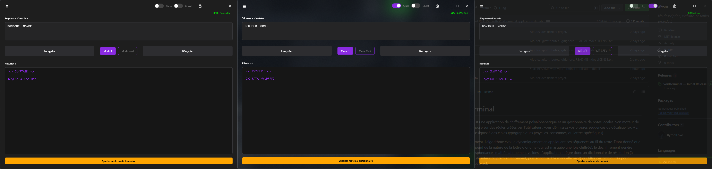
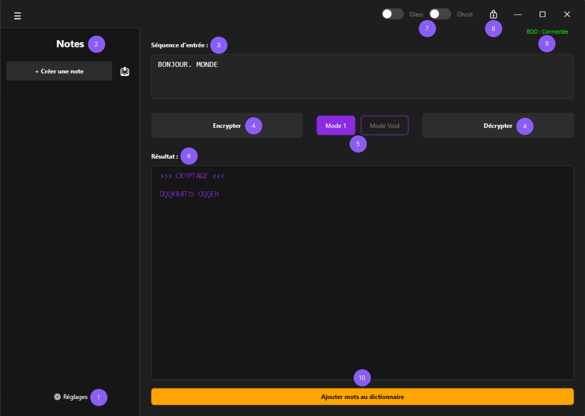
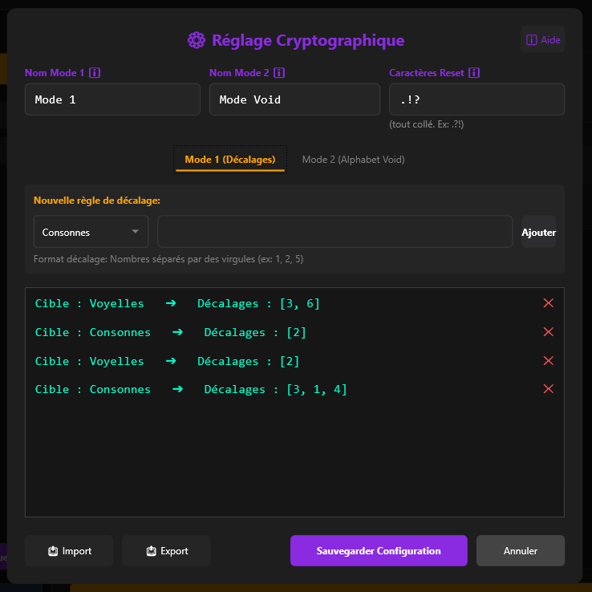
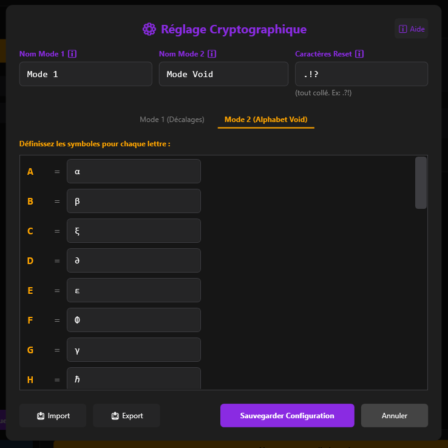

# VoidTerminal

VoidTerminal est une application de chiffrement polyalphabétique et un gestionnaire de notes locales. Son moteur de substitution repose sur des règles créées par l'utilisateur : vous définissez vos propres séquences de décalage (ex: +3, +1, +4) et les assignez à des cibles typographiques (voyelles, consonnes, ou lettres spécifiques).

Lors du chiffrement, l'algorithme évolue dynamiquement en appliquant ces séquences au fil du texte. Étant donné que le décalage dépend de la nature de la lettre d'origine (qui est masquée une fois chiffrée), le déchiffrement génère plusieurs correspondances mathématiquement valides. L'application intègre donc un dictionnaire de résolution (à importer par l'utilisateur au premier lancement, puis enrichissable manuellement) qui filtre ces ambiguïtés pour retrouver le mot exact.

En complément, un module d'alphabet personnalisé permet de substituer visuellement les lettres par les symboles de votre choix. L'intégralité du profil (notes, dictionnaire personnel, paramètres des règles et alphabet personnalisé) est chiffrée et stockée localement en AES-256.

-----

## Aperçu de l'interface

1. Réglages
2. Gestionnaire de notes
3. Séquence d'entrée
4. Encrypter / Décrypter
5. Sélecteur de mode (Mode 1 / Mode Void)
6. Résultat
7. Modes d'affichage (Glass / Ghost)
8. Verrouillage de l'application
9. Statut du profil chiffré
10. Ajout manuel au dictionnaire

## Installation

| Version | Taille | Prérequis |
|---------|--------|-----------|
| [VoidTerminal_v1.0.0.zip](https://github.com/ByronlLove/VoidTerminal/releases/download/v1.0.0/VoidTerminal_v1.0.0.zip) | 197 Ko | [.NET 10 Runtime](https://dotnet.microsoft.com/download/dotnet/10.0) |
| [VoidTerminal_v1.0.0_win-x64.zip](https://github.com/ByronlLove/VoidTerminal/releases/download/v1.0.0/VoidTerminal_v1.0.0_win-x64.zip) | 60.4 MB | Aucun |

1. Téléchargez l'archive de votre choix
2. Extrayez et exécutez `Void.exe`
3. Définissez votre mot de passe maître (clé AES-256)
4. Importez un dictionnaire `.txt` — source française recommandée : [French Wordlist par Taknok](https://github.com/Taknok/French-Wordlist/blob/master/francais.txt)

## Fonctionnalités

### Mode 1 — Décalages

Le cœur mathématique de l'application. Via le Réglage Cryptographique, l'utilisateur définit des règles de chiffrement, chacune associant une cible typographique (Voyelles, Consonnes, ou une lettre spécifique) à une séquence de décalages.

L'algorithme avance dans la liste des règles de manière unidirectionnelle : lors d'un changement de nature (ex: consonne vers voyelle), le pointeur cherche la prochaine règle compatible en avançant, en sautant celles de nature opposée. S'il atteint la fin de la liste sans trouver de règle compatible, il repart de la Règle 1. Les séquences de décalages (ex: `3, 6`) bouclent cycliquement au sein d'une même règle. Un espace ne rompt pas un bloc. Un caractère configuré comme caractère reset (ex: `.`) réinitialise l'ensemble des curseurs à zéro.

**Exemple de configuration :**
- Règle 1 (Voyelles) : `3, 6`
- Règle 2 (Consonnes) : `2`
- Règle 3 (Voyelles) : `2`
- Règle 4 (Consonnes) : `3, 1, 4`

**`BONJOUR. MONDE` → `DQQKRAT⊙ OQQEH`**

| Lettre | Nature   | Règle active        | Décalage | Résultat |
|--------|----------|---------------------|----------|----------|
| B      | Consonne | Règle 2 (Consonnes) | +2       | D        |
| O      | Voyelle  | Règle 3 (Voyelles)  | +2       | Q        |
| N      | Consonne | Règle 4 (Consonnes) | +3       | Q        |
| J      | Consonne | Règle 4 (Consonnes) | +1       | K        |
| O      | Voyelle  | Règle 1 (Voyelles)  | +3       | R        |
| U      | Voyelle  | Règle 1 (Voyelles)  | +6       | A        |
| R      | Consonne | Règle 2 (Consonnes) | +2       | T        |
| .      | Reset    | —                   | —        | ⊙        |
| M      | Consonne | Règle 2 (Consonnes) | +2       | O        |
| O      | Voyelle  | Règle 3 (Voyelles)  | +2       | Q        |
| N      | Consonne | Règle 4 (Consonnes) | +3       | Q        |
| D      | Consonne | Règle 4 (Consonnes) | +1       | E        |
| E      | Voyelle  | Règle 1 (Voyelles)  | +3       | H        |

### Mode 2 — Alphabet Void

Le Mode Void est une surcouche visuelle appliquée après le chiffrement Mode 1. Dans le Réglage Cryptographique, chaque lettre de l'alphabet est assignée à un symbole de votre choix (caractère spécial, chiffre, ou autre). Le résultat est un texte visuellement opaque, illisible sans la connaissance de l'alphabet utilisé.

Les espaces sont remplacés par `(_)`.

**Avec l'alphabet de l'exemple :** `D=∂`, `Q=∅`, `K=κ`, `R=ρ`, `A=α`, `T=τ`, `O=ο`, `E=ε`, `H=ℏ`

`DQQKRAT⊙ OQQEH` → `∂∅∅κρατ⊙(_)ο∅∅εℏ`

### Dictionnaire et résolution d'ambiguïtés

En raison de la nature asymétrique du Mode 1, le déchiffrement d'une séquence produit plusieurs correspondances mathématiquement valides. L'application croise ces résultats avec un dictionnaire pour retrouver le mot exact.

**Apprentissage manuel :** si un mot est inconnu du dictionnaire, il s'affiche en orange. Un clic ouvre la fenêtre des combinaisons possibles — sélectionnez la bonne correspondance et ajoutez-la à votre dictionnaire personnel.
* **Resynchronisation du moteur :** Le cycle de chiffrement étant continu, si plusieurs mots inconnus se suivent, le moteur suspend le déchiffrement. La résolution manuelle du premier mot "orange" est indispensable pour resynchroniser l'algorithme (lui redonner le bon décalage) et débloquer automatiquement la suite de la phrase.

### Gestionnaire de notes

Création, édition et renommage de notes privées stockées localement. Chaque note est chiffrée dans le profil principal `data.void`.

### Import / Export

| Format | Contenu | Usage |
|--------|---------|-------|
| `.voidn` | Notes | Partage de notes avec un utilisateur possédant le même mot de passe maître |
| `.voidd` | Dictionnaire personnel | Transfert du lexique entre machines |
| `.voidc` | Configuration cryptographique (règles Mode 1 + alphabet Void) | Partage de configuration entre utilisateurs |
| `.void` | Profil complet | Sauvegarde et restauration intégrale |

## Fonctionnalités prévues

- [ ] **Gestion des caractères spéciaux** : Ajout de la prise en charge de la ponctuation et des symboles depuis le Réglage Cryptographique.
- [ ] **Injection de bruit (Padding)** : Ajout de caractères aléatoires générés dynamiquement (séparés par un marqueur) avant le chiffrement pour fausser la longueur d'origine des mots.

## Spécifications techniques

- **Environnement :** C# / .NET 10
- **Interface :** WPF (Windows Presentation Foundation)
- **Chiffrement du profil :** AES-256-CBC, PBKDF2 (100 000 itérations, SHA-256)
- **Plateforme :** Windows uniquement

## Crédits

**ByronlLove** — Conception de l'architecture cryptographique et logicielle, 
définition des algorithmes, conception de l'expérience utilisateur (UI/UX), 
tests (QA) et publication.

Code source implémenté avec l'assistance de Gemini (Google AI).

## Licence

Ce projet est distribué sous licence [MIT](LICENSE).
